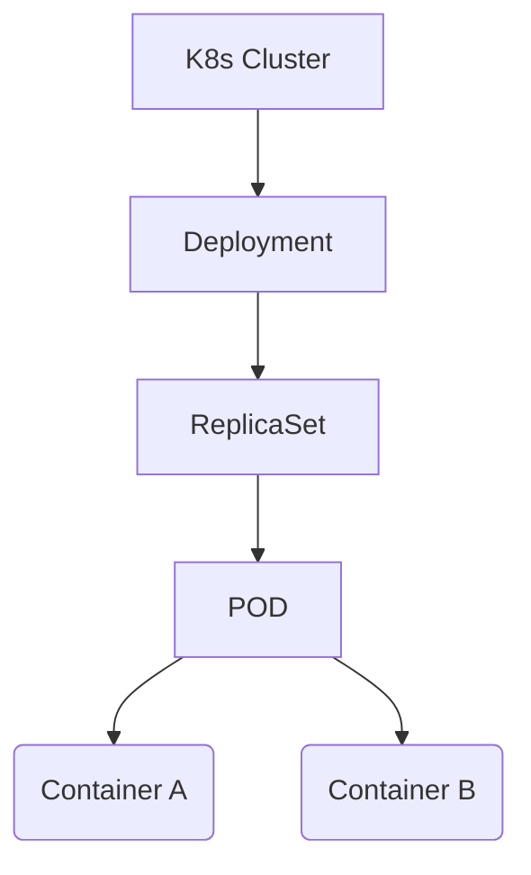
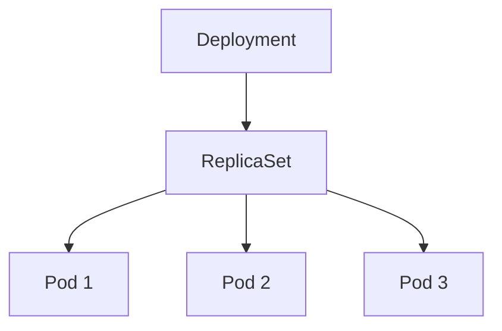
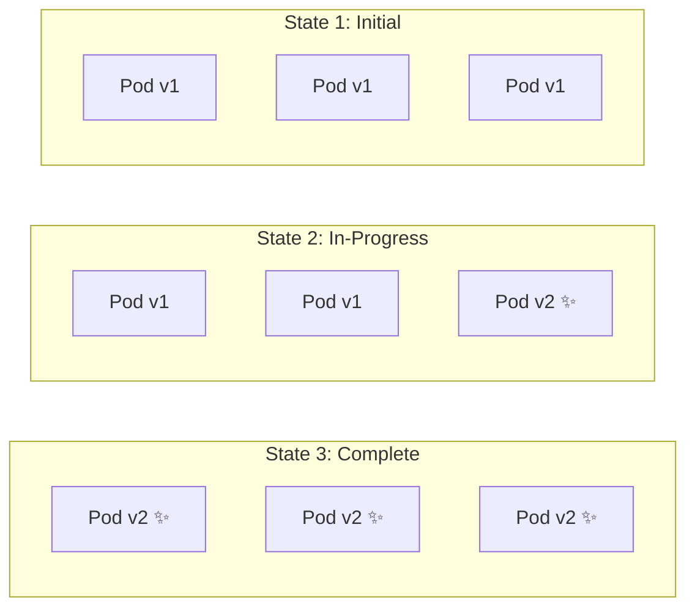
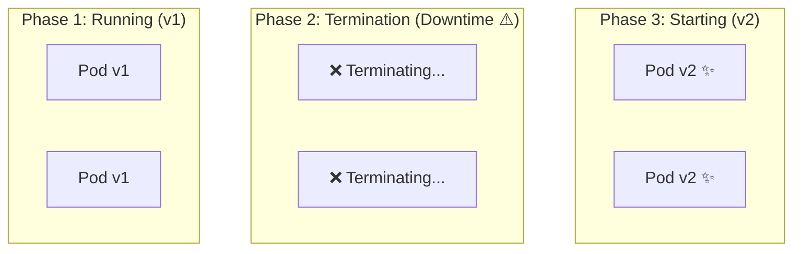

## Topics 

- [Pods](#pods)
    - [Pod Architecture](#pod-architecture)  
    - [Pod Networking](#pod-Networking)   
    - [Pod Storage](#pod-storage)   
    - [Pod lifecycle](#pod-lifecycle)  
    - [Multi Container Pods](#multi-container-pods)  
    - [Init Containers](#init-containers)  
    - [Sidecars](#sidecars)  
- [ReplicaSets](#replicasets)  
- [Deployments](#deployments)   
    - [ReplicaSet Abstraction Hierarchy](#replicaset-Abstraction-Hierarchy)  
    - [Key Features of a Deployment](#key-features-of-a-deployment)   
    - [Example Deployment Manifest file](#example-deployment-manifest-file)     
    - [Essential kubectl commands](#essential-kubectl-commands)  
    - [Rolling Update](#rolling-update)   
    - [Recreate](#recreate) 
    - [Rollback](#rollback)   
    - [Revision History](#revision-history)   
- [DeamonSets](#deamonsets)  
- [StatefulSets](#statefulsets)  
- [Jobs](#jobs)   
- [CronJobs](#cronjobs)   
- [Labels](#labels)   
- [Labels and Selectors](#labels-and-Selectors)  
    - [Labels](#labels)  
    - [Selectors](#selectors)    
- [Interview Questions](#interview-questions)  

## Hands On

<youtube video>

Topics Covered: 

- Deploy Nginx  
- Scale deployment 
- Rollback deployment 
- Run CronJob 
- Create StatefulSet 

### Pods

A Pod is the smallest deployable unit in Kubernetes, its a wrapper around one or more containers that.  

- Share the same network namespace
- Share the same IP address
- Share the same port space
- Can share storage volumes
- Have the same lifecycle



** Creating a Pod :**   

pod.yaml 

```yaml  
apiVersion: v1 
kind: Pod 

metadata: 
  name: nginx 

spec: 
  containers: - name: nginx image: nginx

  - name: nginx 
    image: nginx
```   

Commands:  

```  
// create pod  
kubectl apply -f pod.yaml

// view details 
kubectl describe pod nginx 

// delete pod 
kubectl delete pod nginx
```  

#### Pod Architecture 

```  
                    Pod
     +------------------------------------+
     |                                    |
     | IP Address: 10.244.1.5             |
     |                                    |
     |  Container 1      Container 2      |
     |     Nginx             App          |
     |                                    |
     |  Shared Network                    |
     |  Shared Volumes                    |
     |                                    |
     +------------------------------------+
``` 

Everything inside the Pod behaves like processes running on the same machine.

#### Pod Networking 

- Each pod gets one unique IP address and one network namespace.  
- Containers inside the same Pod communicate using localhost.  
- Pods communicate with other Pods using Pod IPs or, more commonly, through Kubernetes Services.  

#### Pod Storage 

- Containers in the same pod can share storage using volumes. 
- if one container writes at `shared-data/log.txt`, then the other container can read the same file.  

#### Pod lifecycle 

Pod has following lifecycle 

**Pending** : The Pod has been accepted by Kubernetes but is not yet running. Possible Reasons:

- Image is downloading.
- Waiting for scheduling.
- Persistent volume not attached.
- Waiting for resources.

**Running :** The Pod has been scheduled to a node, and all required containers are running.  
**Succeeded :** All containers completed successfully. Typically used for Jobs, Database migrations, Backup tasks.   
**Fail :**  One or more containers exited unsuccessfully and will not restart. Possible reasons:

- Application crash
- Invalid command
- Missing configuration
- Image issues

**Unknown :** The Kubernetes control plane cannot determine the Pod's state. Possible reasons :   

- Node communication failure   
- Network partition   
- Kubelet unavailable  

**Pod Lifecycle Diagram :**  

``` 
Pending -> Container Image Pull -> Scheduled -> Running -> Completed O

OR

Faield -> Deleted 
```  

**Pod Conditions :**  

Pods also have conditions that describe their health. 

Check: 

```
$ kubectl describe pod nginx 

PodScheduled     True
Initialized      True
ContainersReady  True
Ready            True
```  
|Condition|Description|  
|---|---|
|PodScheduled|Assigned to a node|   
|Initialized|Init containers completed|   
|ContainersReady|All application containers are ready|   
|Ready|Pod can receive traffic through a Service|   

#### Multi Container Pods

- A Pod may contain multiple containers that work together. 
- These containers share same IP, storage volumes, lifecycle, and can communicate using localhost. 
- Also note that only use them when containers are tightly coupled. For example main application with services like log collector, proxy, metrics exporter, configuration reloader. Avoid placing unrelated applications in the same Pod.
- These container communicate with each other using localhost. 

```
App [localhost:8080] -> nginx-proxy [localhost:80] 
``` 
#### Init Containers

An init container is a special container that runs before the application containers. It is used to perform initialization tasks. Below are the usecases: 

- Wait for a database
- Download configuration
- Create directories
- Initialize data
- Verify dependencies

#### Sidecars 

A sidecar is an additional container in the same Pod that extends or supports the main application. Examples:

- Log forwarding
- Metrics collection
- Proxy
- Secret synchronization
- Configuration reload
- Service mesh proxies (such as Envoy)

### ReplicaSets 

A ReplicaSet ensures that a specified number of Pod replicas are always running. Example:

```  
replicas: 3
``` 

```
ReplicaSet -> [Pod, Pod, Pod]
``` 

If one Pod crashes:

- Desired = 3
- Current = 2
- ReplicaSet creates another Pod  

Normally, ReplicaSets are managed automatically by Deployments.  

### Deployments 

- In Kubernetes, a Deployment is a declarative API object (apps/v1) that manages the lifecycle of your application by automatically creating and maintaining a set of identical running instances (Pods).
- Instead of managing individual Pods manually, you describe the desired state in a Deployment specification (e.g., "I want 3 replicas of my web app running container image nginx:1.25"), and the Kubernetes
- Controller Manager continuously works to match the actual state to your desired state.

#### ReplicaSet Abstraction Hierarchy

A Deployment manages ReplicaSets, which in turn manage Pods:



- Deployment: Controls updates, rollouts, version history, and scaling strategy.
- ReplicaSet: Ensures the exact specified number of Pod replicas are running at any given time.
- Pod: The smallest deployable unit in Kubernetes containing one or more application containers.

#### Key Features of a Deployment

1. Declarative Updates & Zero-Downtime Rollouts: When you update the container image or configuration, the Deployment performs a Rolling Update by gradually creating new Pods with the new version while stopping old ones, ensuring zero application downtime.

2. Automated Rollbacks: Kubernetes tracks every revision of a Deployment. If a newly deployed version breaks or crashes, you can instantly roll back to a previous stable state: `kubectl rollout undo deployment/my-app`

3. Scaling Up & Down: Easily scale the number of running application instances manually or automatically via a Horizontal Pod Autoscaler (HPA): `kubectl scale deployment my-app --replicas=5`

4. Self-Healing: If a node crashes or a Pod fails health checks, the Deployment (via its underlying ReplicaSet) automatically provisions new Pods to maintain your desired replica count.

5. Pause & Resume: You can pause a Deployment, apply multiple changes to its spec, and resume it to trigger a single update cycle instead of triggering multiple rollouts.

#### Example Deployment Manifest file: 

```yaml  
apiVersion: apps/v1
kind: Deployment
metadata:
  name: web-app-deployment
  labels:
    app: web-app
spec:
  replicas: 3
  selector:
    matchLabels:
      app: web-app
  template:
    metadata:
      labels:
        app: web-app
    spec:
      containers:
      - name: nginx
        image: nginx:1.25
        ports:
        - containerPort: 80
```  

#### Essential kubectl commands :   

- Apply Deployment : `kubectl apply -f deployment.yaml`|   
- Check Status : `kubectl get deployments`  
- View Rollout Progress : `kubectl rollout status deployment/web-app-deployment` 
- View Revision History : `kubectl rollout history deployment/web-app-deployment` 
- Rollback Update : `kubectl rollout undo deployment/web-app-deployment`  
- Scale Replicas : `kubectl scale deployment/web-app-deployment --replicas=5`   

#### Rolling Update 

A Rolling Update is the default deployment strategy in Kubernetes. It updates Pods incrementally—replacing old Pod instances with new ones step-by-step—ensuring zero downtime for your application while maintaining service availability throughout the process.

**How It Works :**   

1. Incremental Replacement: Kubernetes creates a few Pods with the new version and waits for them to pass readiness checks.
2. Traffic Shifting: Once new Pods are healthy, service traffic is routed to them.
3. Termination: Old Pods are gradually terminated.
4. Repeat: This cycle repeats until all Pods are running the updated version.



**Key Configuration Parameters :**   

You configure a rolling update under spec.strategy.rollingUpdate in your Deployment manifest:

|Parameter|Description|Default|Example|    
|---|---|---|---|
|maxSurge|Max number (or %) of Pods that can be created above the desired replica count during the update.|25%|maxSurge: 1 or 25%|   
|maxUnavailable|Max number (or %) of Pods that can be unavailable relative to desired count during the update.|25%|maxUnavailable: 0 (strict zero downtime)|  

Example Manifest (deployment.yaml)

``` 
apiVersion: apps/v1
kind: Deployment
metadata:
  name: my-app
spec:
  replicas: 4
  strategy:
    type: RollingUpdate
    rollingUpdate:
      maxSurge: 1          # Max 5 pods total during update (4 + 1)
      maxUnavailable: 0    # Ensures all 4 minimum pods are always healthy
  template:
    metadata:
      labels:
        app: my-app
    spec:
      containers:
      - name: web
        image: nginx:1.25.3
        ports:
        - containerPort: 80
        readinessProbe:
          httpGet:
            path: /
            port: 80
```   

> Readiness Probes are critical! Kubernetes relies on readiness probes to know when a newly launched Pod is ready to serve traffic before removing an old Pod. Without them, traffic might be routed to Pods before they finish initializing.  

**Essential kubectl commands :**  

- Trigger an update `kubectl set image deployment/my-app web=nginx:1.26.0`  
- Monitor rollout status `kubectl rollout status deployment/my-app` 
- View deployment history `kubectl rollout history deployment/my-app`  
- Undo/Rollout an update `kubectl rollout undo deployment/my-app`   

**Advantage and Trade-offs :**   

- Pros 
    - Zero downtime. 
    - Controlled resource utilization (doesn't require double capacity like Blue/Green deployments).  
    - Fast automated rollback if a deployment fails.   
- Cons
    - Multiple versions of your application code (v1 and v2) run simultaneously during the transition, requiring backwards-compatible APIs/database schemas.   

#### Recreate 

In Kubernetes, Recreate is the second built-in Deployment strategy (alongside RollingUpdate). Unlike RollingUpdate, the Recreate strategy kills all existing Pods simultaneously before creating any new Pods.

**How It Works :**  

1. Shutdown: All running Pods (Version 1) are immediately scaled down to 0 and terminated.
2. Downtime Window: There is a brief period where no Pods exist and the application is unavailable.
3. Startup: New Pods (Version 2) are created and initialized at the same time.


**Example Configuration reload :**  

```mermaid  
apiVersion: apps/v1
kind: Deployment
metadata:
  name: my-app
spec:
  replicas: 3
  strategy:
    type: Recreate   # All v1 pods deleted before v2 pods are created
  template:
    metadata:
      labels:
        app: my-app
    spec:
      containers:
      - name: web
        image: my-app:v2.0.0
```

**When use Recreate :**  

While RollingUpdate avoids downtime, Recreate is essential in specific scenarios:

1. Breaking Database Schema Changes: If Version 1 and Version 2 cannot run against the database schema at the same time without causing corruption or errors.
2. Shared Storage Locks (ReadWriteOnce volumes): When pods attach to persistent volumes that only support being mounted by one Pod at a time (e.g., AWS EBS volumes).
3. Strict Singletons: Applications that must never have multiple instances running concurrently.
4. Staging / Dev Environments: Simple deployments where temporary downtime doesn't matter and you want to save cluster compute overhead during rollouts.

#### Rollback 

In Kubernetes, a Rollback is the process of reverting a Deployment (or StatefulSet/DaemonSet) back to a previous revision when a new deployment fails, crashes, or introduces bugs.  

**How Kubernetes Manages Rollbacks :**  

Every time you update a Deployment's pod template (e.g., changing the container image, environment variables, or resource limits), Kubernetes:

1. Creates a new ReplicaSet for the new revision.
2. Saves the previous ReplicaSet in revision history.

During a rollback, Kubernetes does not re-build or re-apply past YAML files. It simply scales up the previous ReplicaSet and scales down the failed ReplicaSet.

```
graph TD
subgraph "Deployment revision history"
    RS1["ReplicaSet v1 (Revision 1)<br/>replicas: 0 → 3 🟢"]
    RS2["ReplicaSet v2 (Revision 2)<br/>replicas: 3 → 0 🔴 (Crashed)"]
end

Trigger["`kubectl rollout undo`"] --> RS2
RS2 -- "Scale down" --> RS1
RS1 -- "Scale up" --> Active[Active Healthy Pods]
```  

**Essential rollback commands :**  

- Check Deployment History `kubectl rollout history deployment/my-app`   
- Inspect a specefic revision `kubectl rollout history deployment/my-app --revision=1`   
- Roll Back to the Immediately Previous Version (revert to revision N-1) `kubectl rollout undo deployment/my-app`   
- Roll Back to a Specific Revision (Revert to a target revision number `revision 1`) `kubectl rollout undo deployment/my-app --to-revision=1`   

**When Should You Roll Back?**   

A rollback is typically triggered manually or automatically (via CI/CD tools or GitOps operators like ArgoCD/Flux) under these conditions:

• ImagePullBackOff: Misspelled image name or invalid tag.
• CrashLoopBackOff: Application crashes on startup (e.g., missing env vars or secrets).
• Readiness/Liveness Probe Failures: Container starts, but health check endpoints fail.
• Performance/Bug Regressions: Metrics (high error rate, memory leak) spike after deployment.

**Useful Tip: Annotation for Revision Notes**   

To see meaningful messages in kubectl rollout history instead of <none>, record the change cause using an annotation:

```yaml     
metadata:
  annotations:
    kubernetes.io/change-cause: "Updated nginx image to 1.25.3"
```  
  
Or when running kubectl:

```  
kubectl annotate deployment/my-app kubernetes.io/change-cause="Upgraded to v2.1.0"
```  

#### Revision History 

In Kubernetes, Revision History is the chronological record of all previous configurations (revisions) of a Deployment. It is what powers Kubernetes' built-in rollback capability, allowing you to inspect past versions and instantly revert to any previous state. Kubernetes manages revision history using ReplicaSets:


1. New Revision Created: Every time you modify a Deployment's spec.template (e.g., container image, environment variables, labels), Kubernetes creates a new ReplicaSet.
2. Old Revisions Preserved: The previous ReplicaSet is scaled down to 0 replicas, but its definition is kept in the cluster.
3. Rollback Source: These 0-replica ReplicaSets store the exact Pod specifications of past versions so Kubernetes can easily scale one back up if you run a rollback.

```  
Deployment: my-app
 ├── Revision 1 (ReplicaSet: my-app-7d9b4b9b94) -> Replicas: 0 (Inactive)
 ├── Revision 2 (ReplicaSet: my-app-689b78b544) -> Replicas: 0 (Inactive)
 └── Revision 3 (ReplicaSet: my-app-549b67b123) -> Replicas: 3 (Active 🟢)
```  

**What Triggers a New Revision?**  

|Action|Creates New Revision?|Reason|  
|---|---|---|  
|Change container image (v1 → v2)|Yes|Modifies spec.template|    
|Change environment variable or config|Yes|Modifies spec.template|     
|Change resource limits (CPU/Memory)|Yes|Modifies spec.template|    
|Scale replicas (e.g., 3 → 10|No|Only changes replica count, not pod template|     
|Update Deployment annotations/labels|No|Doesn't affect spec.template|   


**Controlling History Size: `revisionHistoryLimit` :**   

By default, Kubernetes keeps 10 past revisions. Old ReplicaSets beyond this limit are automatically cleaned up to save cluster resources. You can customize this limit using the `revisionHistoryLimit` field in your Deployment spec:   

```  
apiVersion: apps/v1
kind: Deployment
metadata:
  name: my-app
spec:
  revisionHistoryLimit: 5   # Keeps only the last 5 revisions for rollback
  replicas: 3
  template:
```  

If set to 0: Kubernetes will immediately delete old ReplicaSets after a new deployment finishes, effectively disabling rollbacks.

**Inspecting Revision History :**   

- List all recorded revisions `kubectl rollout history deployment/my-app`  
- View the underlying ReplicaSets storing the revisions `kubectl get replicasets -l app=my-app`   
- See detailed spec of a specific revision `kubectl rollout history deployment/my-app --revision=2`   

### DeamonSets 

A DaemonSet is a Kubernetes workload object that ensures a single copy of a Pod runs on every worker node (or a specific subset of nodes) in your cluster. When new nodes are added to the cluster, the DaemonSet automatically schedules a new Pod onto them. When nodes are removed, those Pods are automatically garbage collected.

**Key Use Cases :**  

DaemonSets are typically used for node-level background services ("daemons"):

1. Log Collection: Running agents like Fluentd, Fluentbit, or Vector on every node to collect container and system logs from /var/log.
2. Cluster Monitoring & Telemetry: Running metrics exporters like Prometheus Node Exporter, Datadog Agent, or New Relic Agent to monitor node CPU, memory, disk, and network usage.
3. Networking & Storage Drivers: Running Container Network Interface (CNI) plugins like Calico, Cilium, or storage plugins like Rook-Ceph / Longhorn.
4. Security & Compliance: Running node security scanners like Falco or Wazuh.

**DaemonSet vs Deployment :**   

|Feature|Deployment|DaemonSet|   
|---|---|---|
|Pod Distribution|Schedules N replicas across the cluster based on load/capacity.|Schedules exactly 1 Pod per Node.|   
|Replica Count|Explicitly defined (spec.replicas: 3).|Implicitly calculated based on cluster node count.|   
|Adding a New Node|No new Pod created unless auto-scaling triggers.|Automatically creates a Pod on the new node.|    
|Use Case|Stateless web apps, APIs, microservices.|Node agents, loggers, monitors, networking drivers.|   

**Example Manifest file :**   

Below is an example of running Prometheus Node Exporter across all nodes:   

Daemonset.yaml    

```yaml  
apiVersion: apps/v1
kind: DaemonSet
metadata:
  name: node-exporter
  namespace: kube-system
spec:
  selector:
    matchLabels:
      app: node-exporter
  template:
    metadata:
      labels:
        app: node-exporter
    spec:
      # Tolerations allow running on control-plane nodes if needed
      tolerations:
      - key: node-role.kubernetes.io/control-plane
        operator: Exists
        effect: NoSchedule
      containers:
      - name: node-exporter
        image: prom/node-exporter:v1.7.0
        ports:
        - containerPort: 9100
          hostPort: 9100     # Exposes metric port on host node
```   

**Running DaemonSets on Specific Nodes :**   

If you don't want a DaemonSet on every node, you can filter nodes using:

- `nodeSelector` : Target nodes with specific labels (e.g., gpu: "true").
- `nodeAffinity` : Advanced node targeting rules.
- Taints & Tolerations: By default, DaemonSets skip nodes with taints (like master/control-plane nodes) unless explicit tolerations are declared in the Pod template.

### StatefulSets 

A StatefulSet is the Kubernetes workload object designed to manage stateful applications—such as databases, message queues, and distributed consensus systems—that require unique pod identities and persistent data storage. Unlike a Deployment (where Pods are identical, stateless, and interchangeable), each Pod managed by a StatefulSet has a stable, sticky identity that persists across restarts and rescheduling.

**Core Features of a StatefulSet :**   

1. Predictable, Ordinal Naming:
    - Pods receive a fixed index starting at zero: web-0, web-1, web-2.
    - If web-1 crashes or is deleted, Kubernetes replaces it with a new Pod named web-1 (not a random hash string like web-7d9f4b9-x82kz).
2. Dedicated, Stable Storage (volumeClaimTemplates):
    - Each Pod gets its own PersistentVolumeClaim (PVC) automatically named after the Pod (e.g., data-web-0, data-web-1).
    - If web-1 moves to a different physical node, Kubernetes re-attaches the exact same volume (data-web-1) to it, ensuring data persistence.
3. Stable Network Identity (Headless Service):
    - StatefulSets require a Headless Service (clusterIP: None) to provide stable DNS endpoints for each individual Pod:
        - web-0.nginx.default.svc.cluster.local
        - web-1.nginx.default.svc.cluster.local
    - This is critical for database clusters where nodes must communicate directly with a specific primary or secondary replica.
4. Ordered Deployment and Scaling:
    - Scale Up: Created sequentially in order (web-0 → web-1 → web-2). web-1 will not start until web-0 is fully Running and Ready.
    - Scale Down: Terminated in reverse ordinal order (web-2 → web-1 → web-0).

**StatefulSet vs. Deployment :**  

| Feature                | Deployment                                   | StatefulSet                                           |
| ---------------------- | -------------------------------------------- | ----------------------------------------------------- |
| **Pod Identity**       | Anonymous & random hash (`app-7d4f9b-82xkz`) | Fixed ordinal index (`app-0`, `app-1`, `app-2`)       |
| **Storage**            | Shared volume or ephemeral storage           | Dedicated volume per pod (`volumeClaimTemplates`)     |
| **Network Address**    | Shared virtual IP via Service                | Individual stable DNS per pod via Headless Service    |
| **Startup / Shutdown** | Parallel & non-deterministic                 | Strict sequential order (`0 → 1 → 2`)                 |
| **Primary Use Cases**  | Stateless web apps, APIs, microservices      | Databases (PostgreSQL, MongoDB), Kafka, Elasticsearch |

```yaml  
apiVersion: v1
kind: Service
metadata:
  name: nginx-headless
  labels:
    app: nginx
spec:
  ports:
  - port: 80
    name: web
  clusterIP: None    # Headless Service creates DNS entries for individual pods
  selector:
    app: nginx
---
apiVersion: apps/v1
kind: StatefulSet
metadata:
  name: web
spec:
  serviceName: "nginx-headless" # Connects to the headless service
  replicas: 3
  selector:
    matchLabels:
      app: nginx
  template:
    metadata:
      labels:
        app: nginx
    spec:
      containers:
      - name: nginx
        image: nginx:1.25.3
        ports:
        - containerPort: 80
          name: web
        volumeMounts:
        - name: www
          mountPath: /usr/share/nginx/html
  # Automatically creates a unique PVC for each pod (www-web-0, www-web-1, etc.)
  volumeClaimTemplates:
  - metadata:
      name: www
    spec:
      accessModes: [ "ReadWriteOnce" ]
      resources:
        requests:
          storage: 1Gi
```  

**Common Use Cases :**   

- Relational Databases: PostgreSQL / MySQL (Primary-Replica setups where primary must be db-0).
- NoSQL Databases: MongoDB Replica Sets, Cassandra, CockroachDB.
- Distributed Queues & Brokers: Apache Kafka (brokers require fixed IDs), ZooKeeper, RabbitMQ.
- Distributed Search & Cache: Elasticsearch cluster nodes, Redis Sentinel.

### Jobs 

A Job creates one or more Pods and ensures that a specified number of them successfully terminate (exit with code 0). Once the task completes, the Pod stops running, but its logs remain accessible. If a Pod fails (non-zero exit code or hardware crash), the Job controller automatically reschedules or retries it up to a configured limit (backoffLimit).

**Key Features of a Job :**  

- Completions (spec.completions): The target number of successful Pod completions needed for the Job to be marked finished.
- Parallelism (spec.parallelism): How many Pods can run concurrently.
- Restart Policy: Must be set to OnFailure or Never (cannot be Always).

**Common Use Cases for Jobs :**   

- Running database migrations (e.g., prisma migrate, rails db:migrate).
- Batch image or video processing.
- Training a machine learning model.
- Performing a one-off database backup or report generation.

**Example Job Manifest job.yaml :** 

```yaml
apiVersion: batch/v1
kind: Job
metadata:
  name: db-migration-job
spec:
  completions: 1       # Total successful runs needed
  backoffLimit: 3      # Max retries before marking job as failed
  template:
    spec:
      restartPolicy: OnFailure
      containers:
      - name: migration
        image: my-app-migration:v1.2
        command: ["npm", "run", "migrate"]
``` 

### CronJobs 

A CronJob manages Jobs on a time-based schedule (like standard Linux cron). Instead of running immediately, a CronJob periodically creates a new Job object based on a cron schedule string (e.g., every night at midnight).

**Key Features of a CronJob :**   

- schedule: Standard 5-field cron syntax (minute hour day-of-month month day-of-week).
- concurrencyPolicy: Defines what happens if a new run triggers while the previous run is still active:
    - Allow (default): Runs concurrent jobs side-by-side.
    - Forbid: Skips the new job if the previous one hasn't finished.
    - Replace: Cancels the currently running job and starts the new one.
- History Limits: successfulJobsHistoryLimit (default 3) and failedJobsHistoryLimit (default 1) clean up old completed Job objects.

**Common Use Cases for CronJobs :**  

- Daily database backups at 2:00 AM.
- Hourly cache warming or report generation.
- Sending weekly email newsletters.
- Periodic cleanup of temporary disk storage or expired user sessions.

**Example CronJob Manifest cronjob.yaml :**  

``` 
apiVersion: batch/v1
kind: CronJob
metadata:
  name: nightly-backup
spec:
  schedule: "0 2 * * *"         # Runs every day at 02:00 AM UTC
  concurrencyPolicy: Forbid     # Don't start a new backup if the last one is still running
  successfulJobsHistoryLimit: 3
  failedJobsHistoryLimit: 1
  jobTemplate:
    spec:
      template:
        spec:
          restartPolicy: OnFailure
          containers:
          - name: backup-tool
            image: postgres:15-alpine
            command: ["/bin/sh", "-c", "pg_dump -h db.prod -U postgres > /backups/db.sql"]
```  

### Labels and Selectors 

In Kubernetes, Labels and Selectors are the fundamental mechanism used to organize, group, and connect API resources (such as Pods, Deployments, Services, and Nodes) to one another. Instead of referencing objects by hardcoded IDs or IP addresses, Kubernetes uses a decoupled key-value tagging model.   

#### Labels 

Labels are key-value pairs attached to Kubernetes objects (Pods, Nodes, Services, etc.). They describe identifying attributes of objects that are meaningful to users, but do not directly change how the application runs.

**Common Label Examples :**   

```yaml   
metadata:
  labels:
    app: payment-service
    tier: backend
    environment: production
    version: "2.1.0"
    team: checkout
```   

#### Selectors  

Selectors are filter queries used to group objects based on their labels. Higher-level resources use selectors to find and target lower-level resources.

**How Selectors Connect Resources :**   

```yaml  
graph TD
Service["Service<br/><code>selector: app=web</code>"]

subgraph "Cluster Pods"
    Pod1["Pod 1<br/><code>app: web</code> ✅"]
    Pod2["Pod 2<br/><code>app: web</code> ✅"]
    Pod3["Pod 3<br/><code>app: db</code> ❌"]
end

Service -->|Routes traffic to| Pod1
Service -->|Routes traffic to| Pod2
``` 

1. Services → Pods: A Service uses a selector to route network traffic to all matching Pods.
2. Deployments → Pods: A Deployment uses matchLabels to track which Pods it manages.
3. Pods → Nodes (nodeSelector): Pods use node selectors to request being scheduled on nodes with specific labels (e.g., disktype: ssd).
4. Network Policies → Pods: Controls which Pods are allowed to talk to each other.

**Types of Selectors :**  

Kubernetes supports two types of label requirements:

1. Equality-Based Selectors : Matches exact label key-value pairs using =, ==, or !=. YAML Example (matchLabels):

```yaml  
spec:
  selector:
    matchLabels:
      app: web
      tier: frontend
```  

2. Set-Based Selectors : Allows filtering by a set of values using operators: In, NotIn, Exists, DoesNotExist. YAML Example (matchExpressions):

```yaml    
spec:
  selector:
    matchExpressions:
      - key: environment
        operator: In
        values: [production, staging]
      - key: tier
        operator: NotIn
        values: [legacy]
      - key: encrypted
        operator: Exists
```   

**Practical Example: Connecting a Deployment to a Service :**   

In this example, the Service targets the Pods managed by the Deployment because their labels match (app: my-web-app):

```yaml   
# 1. THE DEPLOYMENT (Creates Pods with labels)
apiVersion: apps/v1
kind: Deployment
metadata:
  name: web-deployment
spec:
  replicas: 3
  selector:
    matchLabels:
      app: my-web-app       # Deployment tracks pods with this label
  template:
    metadata:
      labels:
        app: my-web-app     # Pods get tagged with this label
    spec:
      containers:
      - name: web
        image: nginx:1.25.3
---
# 2. THE SERVICE (Finds Pods using selector)
apiVersion: v1
kind: Service
metadata:
  name: web-service
spec:
  selector:
    app: my-web-app         # Routes traffic to any Pod tagged app=my-web-app
  ports:
  - port: 80
    targetPort: 80
```  

**Useful kubectl filtering commands :** 

* List pods with a specific label `kubectl get pods -l app=my-web-app`   
* List pods in production or staging environments `kubectl get pods -l 'environment in (production, staging)'`   
* Show labels attached to all pods `kubectl get pods --show-labels`   
* Add a label to a running pod `kubectl label pod web-pod-1 status=debugging`   

## Interview Questions  

**Why not run Pods directly?**   

While you can create a standalone Pod directly in Kubernetes using kubectl run or kind: Pod, doing so in production is considered an anti-pattern. You should almost always use a controller (like a Deployment, StatefulSet, or DaemonSet) instead of creating bare Pods. Otherwise below problems will occurs: 

- No Self-Healing (No Auto-Replacement)   
- No Rolling Updates or Zero-Downtime Releases  
- No Automated Rollbacks  
- No Easy Scaling or Autoscaling   

**Difference between Deployment, Replicaset, StatefulSet, DaemonSet, Job?**  

| Resource    | Primary Goal | Pod Identity | Pod Lifecycle | Best For |
|-------------|--------------|--------------|---------------|----------|
| ReplicaSet  | Ensures N identical Pods are running. | Random hash (`app-7d9b4-x82kz`) | Continuous (restarts on failure) | Internal controller (rarely created manually). |
| Deployment  | Manages ReplicaSets with rolling updates & rollbacks. | Random hash (`app-7d9b4-x82kz`) | Continuous (restarts on failure) | Stateless apps (Web APIs, microservices, frontends). |
| StatefulSet | Manages Pods with unique, persistent identity & storage. | Fixed ordinal (`app-0`, `app-1`) | Continuous (ordered startup/shutdown) | Stateful apps (Databases, Kafka, Elasticsearch). |
| DaemonSet   | Ensures 1 copy of a Pod runs on every worker node. | Node-associated | Continuous (matches node lifecycle) | Node agents (Log collectors, monitoring, CNI networking). |
| Job         | Runs a batch task to completion and exits. | Task-associated | Ephemeral (exits on completion) | Batch tasks (Database migrations, data processing, backups). |


```yaml  
graph TD
    A[What is your workload?] --> B{Does it run continuously or exit?}

    B -->|Exits when finished| Job["Use a **Job** (or CronJob)"]
    B -->|Runs continuously| C{Does it need to run on EVERY node?}

    C -->|Yes, 1 pod per node| DaemonSet["Use a **DaemonSet**"]
    C -->|No| D{Does it require sticky identity or dedicated storage?}

    D -->|Yes, e.g., Databases| StatefulSet["Use a **StatefulSet**"]
    D -->|No, Pods are interchangeable| Deployment["Use a **Deployment**"]
```  

